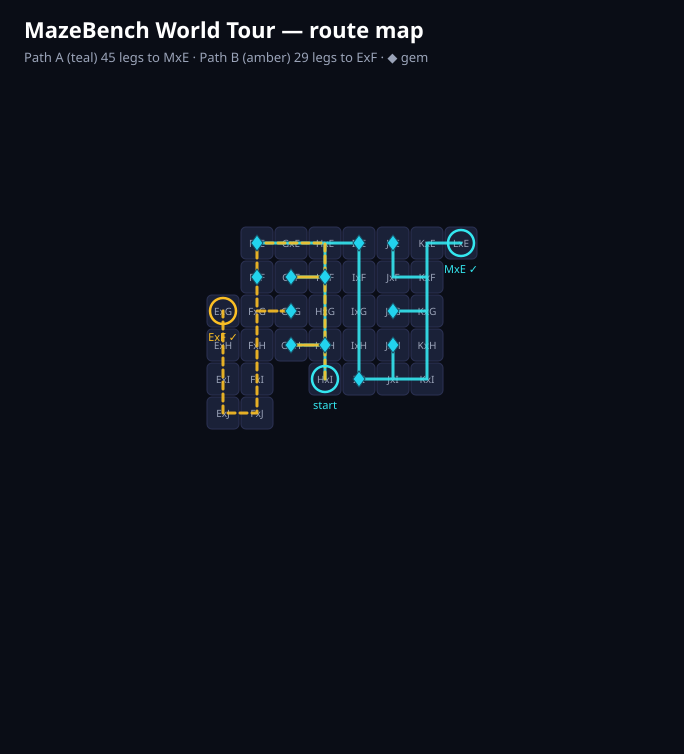

# Maze Extensions — autoplay + world tour for MazeBench

Two Chrome extensions (Manifest V3, no permissions, no network calls) that play
[MazeBench](https://mazebench.com) maze levels through the page's own solver hook:

| | maze-autoplay | maze-tour |
|---|---|---|
| Icon |  |  |
| What | Replays saved single-room solutions: autoplay, step, hold-to-undo, reset, speed | Walks precomputed multi-room tours, crossings included |
| Scope | **42 rooms**, all engine-verified ([registry](maze-autoplay/REGISTRY.md)) | **Path A:** 45 legs, 2152 moves, 💎 10, ends MxE · **Path B:** 29 legs, 1916 moves, 💎 7, ends ExF |
| Docs | [README](maze-autoplay/README.md) · [solver](maze-autoplay/solver/README.md) | [README](maze-tour/README.md) |



## Install (either folder, 30 seconds)

1. `chrome://extensions` → enable **Developer mode**.
2. **Load unpacked** → select `maze-autoplay` and/or `maze-tour`.
3. Autoplay: open any covered level. Tour: open `.../play/maze/level_HxI` fresh, pick Path A/B, press Play.

Reload the extension on `chrome://extensions` after pulling updates.

## How they fit together

```
maze-autoplay/         verify in seconds (verify_one.js) → shorten (wiggle +
  solver/              window splicing) → bank in solutions.js → smoke green
      │  room chains become legs
      ▼
maze-tour/             legs/ + legsB/ per-room files → bundles → panel tours
```

- Machine search caps out around 2–5M states on ordinary hardware; several
  registry entries are human solves the solvers couldn't touch (BxI, DxM…).
  The pipeline above is the whole trick: humans search, machines verify.
- Tour crossings are the hard part of multi-room play: final edge steps are
  idle-gated, room identity is game-primary with stabilized reads, and every
  handoff is statically guarded (see maze-tour README: ordering postmortem).

## Layout

```
.
├── README.md               ← this file
├── maze-autoplay/          extension + registry + solver
└── maze-tour/              extension + legs + route map
```

